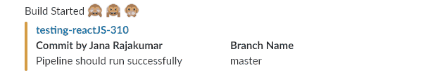
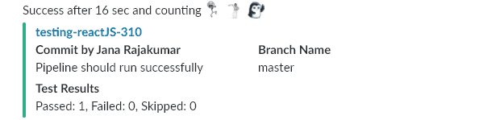
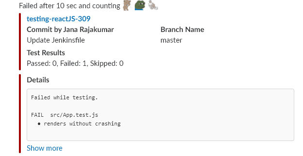
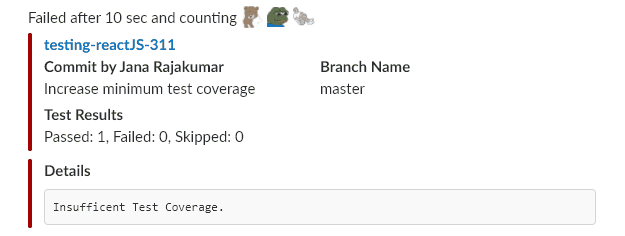
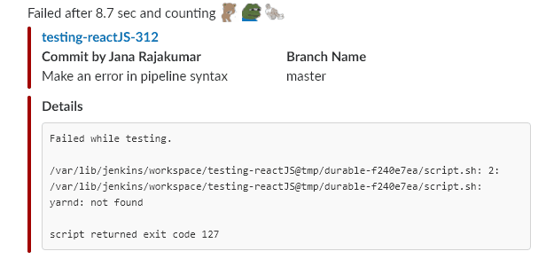

# Jenkins Slack Notification
Send a slack notification for the current build

Usage:

`notifySlack status: currentBuild.currentResult, message: errorMessage, channel: '#builds'`
```
  status = 'STARTED' or 'SUCCESS' or 'FAILURE'
  message = Any custom message you want to display in `details` section
  channel = Slack channel to post: (eg) #builds
```

## Build Started


## Build Passed


## Build Failed (Failing Tests)


## Build Failed (Not Enough Test Coverage)


## Build Failed (Error in Pipeline)
