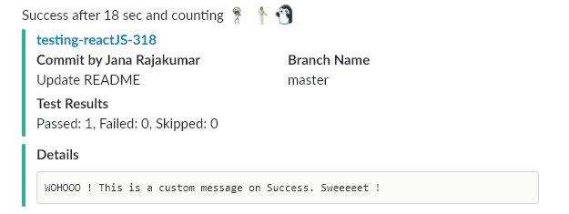

# Jenkins Slack Notification
Send a slack notification for the current build

Usage:
```
@Library('slack-notify') _ // import global shared library

notifySlack status: currentBuild.currentResult, message: errorMessage, channel: '#builds'
```
```
  message = (Optional) Any custom message you want to display in `details` section
  status = (Optional - defaults to 'STARTED') 'STARTED' or 'SUCCESS' or 'UNSTABLE' or 'FAILURE'
  channel = (Optional - defaults to '#builds') Slack channel to post: (eg) #builds
  color = (Optional - defaults to based on currentBuild.currentResult) Value that can either be one of 'good', 'warning', 'danger', or any hex color code
```

## Build Started


## Build Passed


## Build Passed With Custom Message


## Build Failed (Failing Tests)


## Build Failed (Not Enough Test Coverage)


## Build Failed (Error in Pipeline)
